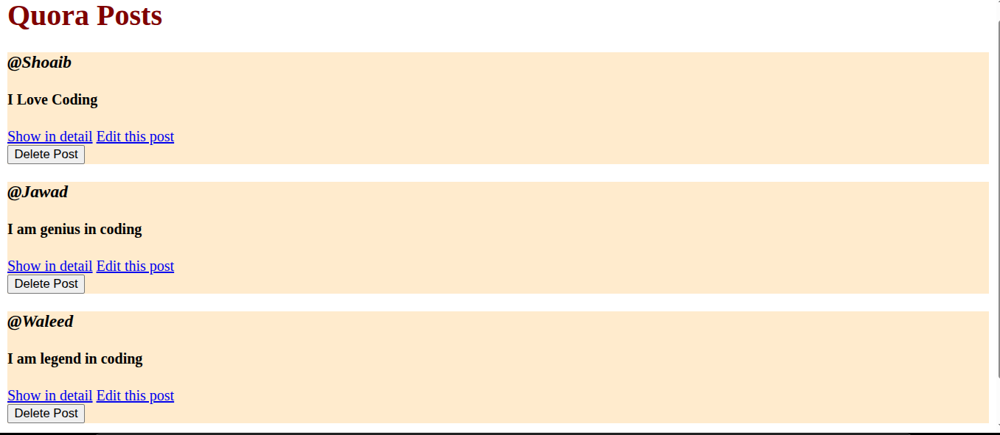
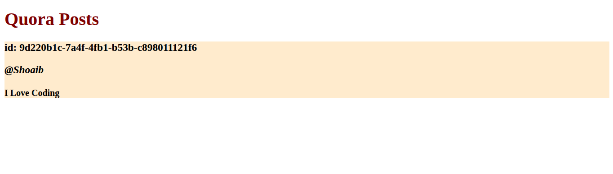
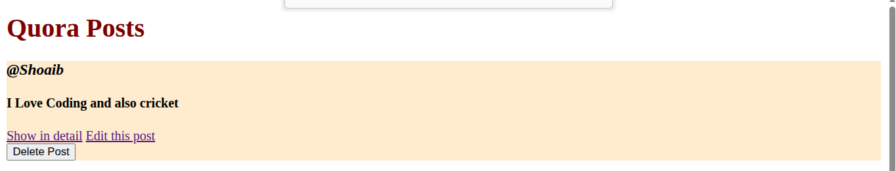
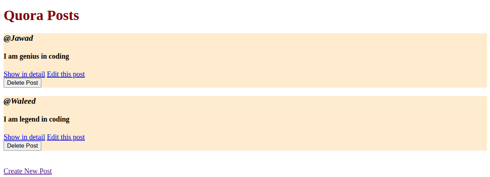
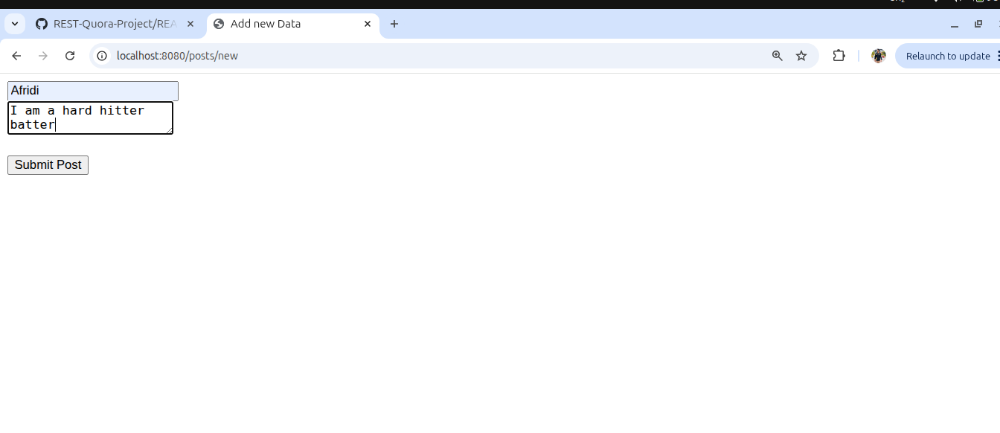
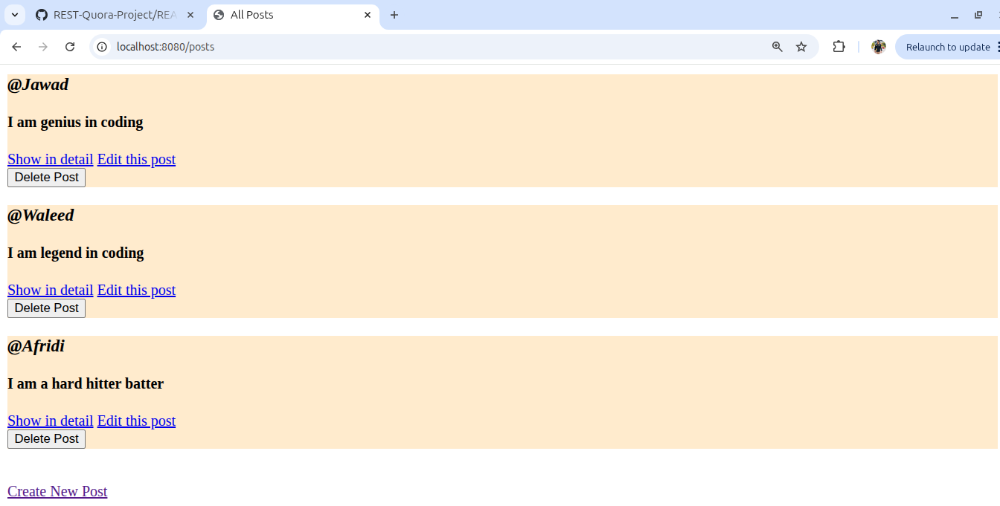

# REST-Quora Project 🚀

A functional web application built to demonstrate **RESTful API Design** and **CRUD operations**. This project mimics the basic post-sharing functionality of Quora.

## 🛠️ Tech Stack
- **Backend:** Node.js, Express.js
- **Templating:** EJS (Embedded JavaScript)
- **Styling:** CSS3
- **Unique IDs:** UUID v4
- **Middleware:** Method-Override, Express.urlencoded

## ✨ Key Features
- **Index Route:** View all posts.
- **Create Route:** Add new posts via a dedicated form.
- **Show Route:** View a specific post in detail using its unique ID.
- **Update Route:** Edit existing post content using PATCH.
- **Delete Route:** Remove posts from the feed using DELETE.

## 📸 Screenshots

| All Posts (Index) | View Details (Show)|
|---|---|
|  |  |

|Edit Post| Edited Post  | Delete Functionality |
|---|---|---|
|  |  |  |

|Add new Post| New Post Added | 
|---|---|---|
|  |  

## 🚀 How to Run Locally
1. Clone the repo: `git clone <your-repo-link>`
2. Install dependencies: `npm install`
3. Start the server: `node index.js`
4. Open: `http://localhost:8080/posts`
